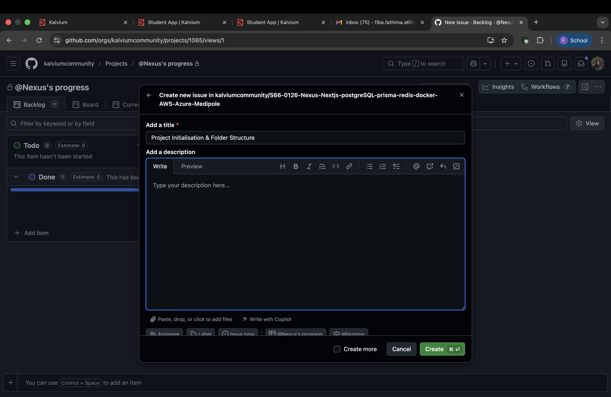

# Medipole Frontend - Real-Time Blood Donation & Inventory Management Platform

## Problem Statement
India's vast network of blood banks and hospitals often faces shortages - not because of lack of donors, but due to poor coordination and outdated inventory tracking. Medipole addresses this challenge by connecting donors, hospitals, and NGOs through secure authentication, geolocation-based matching, and live availability dashboards to ensure timely access to blood when it matters most.

The platform ensures no life is lost due to a data gap by enabling real-time blood inventory tracking, connecting nearby eligible donors to hospitals using geolocation, reducing response time during emergency blood requirements, and providing NGOs and administrators with data-driven insights to improve coordination.

## Folder Structure

### Core Directories

#### `src/`
The main source code directory following the Next.js App Router convention.

- **`app/`** - Contains all route-based pages and layouts using the App Router
  - `page.tsx` - Main homepage component
  - `layout.tsx` - Root layout component
  - `globals.css` - Global styles
  - Subdirectories represent routes (e.g., `/donors`, `/hospitals`, `/admin`)

- **`Components/`** - Reusable UI components organized by feature or purpose
  - Shared components used across multiple pages
  - Organized in subdirectories by feature (e.g., `auth/`, `dashboard/`, `maps/`)

- **`lib/`** - Utility functions, constants, and shared business logic
  - Helper functions
  - API utilities
  - Type definitions
  - Configuration constants

#### `public/`
Static assets served directly by the Next.js server
- Images, icons, favicons
- Static JSON files
- Other static resources

#### Root Files
- `package.json` - Project dependencies and scripts
- `next.config.ts` - Next.js configuration
- `tsconfig.json` - TypeScript configuration
- `postcss.config.mjs` - PostCSS configuration for Tailwind CSS
- `eslint.config.mjs` - ESLint configuration
- `.env` - Environment variables (not committed to version control)

## Setup Instructions

### Installation

1. Make sure you have Node.js installed on your machine (version 18 or higher)
2. Navigate to the Frontend directory:
   ```bash
   cd S66-0126-Nexus-Nextjs-postgreSQL-prisma-redis-docker-AWS-Azure-Medipole/Frontend
   ```
3. Install the dependencies:
   ```bash
   npm install
   # or
   yarn install
   # or
   pnpm install
   ```

### Environment Variables

Create a `.env.local` file in the root of the Frontend directory and add the following environment variables:

```env
NEXT_PUBLIC_API_URL=http://localhost:3001/api
NEXT_PUBLIC_MAPBOX_TOKEN=your_mapbox_token_here
NEXT_PUBLIC_GOOGLE_MAPS_API_KEY=your_google_maps_api_key_here
```

### Running the Application Locally

To run the application locally in development mode:

```bash
npm run dev
# or
yarn dev
# or
pnpm dev
# or
bun dev
```

Open [http://localhost:3000](http://localhost:3000) with your browser to see the result.

## Reflection: Why This Structure?

### Modularity and Separation of Concerns
This structure separates UI components, business logic, and route definitions, making the codebase easier to understand and maintain. Each part of the application has a designated place, preventing code sprawl and confusion.

### Scalability Benefits
- **Component Reusability**: The `Components/` directory allows for easy reuse of UI elements across the application, reducing duplication and ensuring consistency.
- **Feature-based Organization**: Organizing components by feature (auth, dashboard, maps) allows teams to work on different parts of the application simultaneously without conflicts.
- **Maintainable Business Logic**: The `lib/` directory centralizes utility functions and business logic, making it easier to update algorithms or fix bugs in one place.

### Team Collaboration
- **Predictable Navigation**: With a consistent directory structure, team members can easily locate files without extensive orientation.
- **Parallel Development**: Well-defined boundaries between components allow multiple developers to work on different features simultaneously.
- **Onboarding Efficiency**: New team members can quickly understand the codebase structure and begin contributing.

### Future Sprint Preparation
- **Easy Feature Addition**: The modular structure allows for adding new features without disrupting existing functionality.
- **Testing Facilitation**: Isolated components and logic make unit and integration testing more manageable.
- **Performance Optimization**: The clear separation enables targeted performance improvements without affecting unrelated parts of the application.

This structure positions the team well for scaling the application in future sprints, supporting the addition of new user roles, features, and integrations while maintaining code quality and developer productivity.

## Screenshot of Local App Running



*Above: Screenshot of the Medipole application running locally showing the main dashboard interface.*

