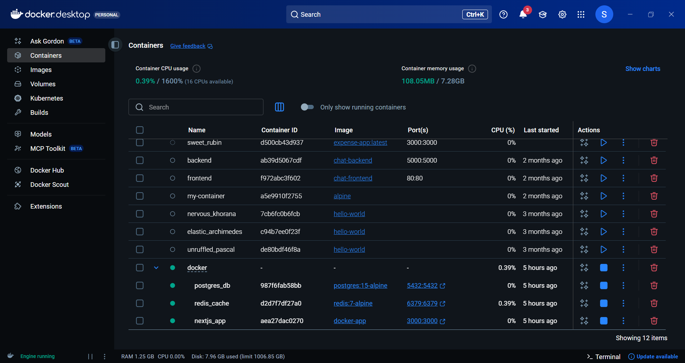
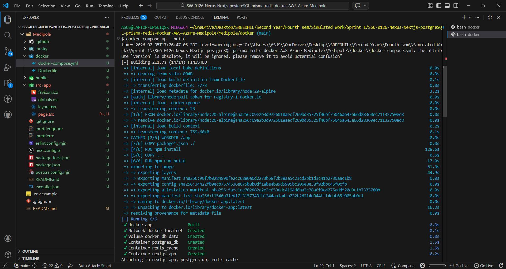

# Medipole Frontend - Real-Time Blood Donation & Inventory Management Platform

## Problem Statement

India's vast network of blood banks and hospitals often faces shortages - not because of lack of donors, but due to poor coordination and outdated inventory tracking. Medipole addresses this challenge by connecting donors, hospitals, and NGOs through secure authentication, geolocation-based matching, and live availability dashboards to ensure timely access to blood when it matters most.

The platform ensures no life is lost due to a data gap by enabling real-time blood inventory tracking, connecting nearby eligible donors to hospitals using geolocation, reducing response time during emergency blood requirements, and providing NGOs and administrators with data-driven insights to improve coordination.

## Folder Structure

### Core Directories

#### `src/`

The main source code directory following the Next.js App Router convention.

- **`app/`** - Contains all route-based pages and layouts using the App Router
  - `page.tsx` - Main homepage component
  - `layout.tsx` - Root layout component
  - `globals.css` - Global styles
  - Subdirectories represent routes (e.g., `/donors`, `/hospitals`, `/admin`)

- **`Components/`** - Reusable UI components organized by feature or purpose
  - Shared components used across multiple pages
  - Organized in subdirectories by feature (e.g., `auth/`, `dashboard/`, `maps/`)

- **`lib/`** - Utility functions, constants, and shared business logic
  - Helper functions
  - API utilities
  - Type definitions
  - Configuration constants

#### `public/`

Static assets served directly by the Next.js server

- Images, icons, favicons
- Static JSON files
- Other static resources

#### Root Files

- `package.json` - Project dependencies and scripts
- `next.config.ts` - Next.js configuration
- `tsconfig.json` - TypeScript configuration
- `postcss.config.mjs` - PostCSS configuration for Tailwind CSS
- `eslint.config.mjs` - ESLint configuration
- `.env` - Environment variables (not committed to version control)

## Route Map & Architecture

### Routing Overview

The App Router in Next.js uses a file-based routing system. Each folder inside the `app/` directory represents a route, and `page.tsx` files define the renderable pages.

### Route Structure

```
src/app/
├── page.tsx                      → Home (public)
├── layout.tsx                    → Global layout with navigation
├── not-found.tsx                 → Custom 404 page
├── login/
│   └── page.tsx                  → Login page (public)
├── dashboard/
│   └── page.tsx                  → Protected route
├── users/
│   ├── page.tsx                  → Users list (protected)
│   └── [id]/
│       └── page.tsx              → Dynamic user profile page (protected)
├── middleware.ts                 → Auth middleware
└── api/
    ├── auth/login/route.ts       → Login API endpoint
    ├── users/route.ts            → Users API endpoint
    ├── admin/route.ts            → Admin API endpoint
    └── [other API routes]
```

### Route Classification

#### Public Routes
- **`/`** - Home page (Welcome to Medipole)
- **`/login`** - Login page

#### Protected Routes (Require valid JWT token)
- **`/dashboard`** - User dashboard
- **`/users`** - Users list
- **`/users/[id]`** - Dynamic user profile page

#### API Routes
- **`/api/auth/login`** - Login endpoint (public)
- **`/api/users`** - User management (protected)
- **`/api/admin`** - Admin endpoints (protected, admin only)

### Authentication Flow

1. User visits `/login` (public)
2. User clicks "Login" button
3. Token is set in browser cookies
4. User is redirected to `/dashboard`
5. Middleware verifies JWT token before allowing access
6. If token is invalid/missing, user is redirected to `/login`

### Key Concepts

- **`page.tsx`** - Defines a page route
- **`[id]/page.tsx`** - Defines a dynamic route where `id` can be any value
- **`layout.tsx`** - Wraps shared UI like navigation bars
- **`middleware.ts`** - Protects routes and verifies authentication
- **`not-found.tsx`** - Custom error page for missing routes

## Setup Instructions

### Installation

1. Make sure you have Node.js installed on your machine (version 18 or higher)
2. Navigate to the Frontend directory:
   ```bash
   cd S66-0126-Nexus-Nextjs-postgreSQL-prisma-redis-docker-AWS-Azure-Medipole/Frontend
   ```
3. Install the dependencies:
   ```bash
   npm install
   # or
   yarn install
   # or
   pnpm install
   ```

### Environment Variables

Create a `.env.local` file in the root of the Frontend directory and add the following environment variables:

```env
NEXT_PUBLIC_API_URL=http://localhost:3001/api
NEXT_PUBLIC_MAPBOX_TOKEN=your_mapbox_token_here
NEXT_PUBLIC_GOOGLE_MAPS_API_KEY=your_google_maps_api_key_here
JWT_SECRET=your_jwt_secret_key
```

### Running the Application Locally

To run the application locally in development mode:

```bash
npm run dev
# or
yarn dev
# or
pnpm dev
# or
bun dev
```

Open [http://localhost:3000](http://localhost:3000) with your browser to see the result.

## Testing the Routes

### Testing Public Routes
1. Visit `http://localhost:3000/` - Should see the home page
2. Visit `http://localhost:3000/login` - Should see the login page without authentication

### Testing Protected Routes
1. Try visiting `http://localhost:3000/dashboard` without logging in → Should redirect to `/login`
2. Try visiting `http://localhost:3000/users/1` without logging in → Should redirect to `/login`
3. Click "Login" button on `/login` page
4. After successful login, you should be redirected to `/dashboard`
5. Now you can access `/users/[id]` pages (e.g., `/users/1`, `/users/42`, etc.)

### Testing Dynamic Routes
- Visit `/users/1` to see user profile for ID 1
- Visit `/users/2` to see user profile for ID 2
- Visit `/users/abc` to see user profile for ID abc
- Visit any undefined route (e.g., `/nonexistent`) to see the custom 404 page

## Reflection: Why This Structure?

### Dynamic Routing Benefits

1. **Scalability**: Dynamic routes (`[id]`) allow the same component to handle infinite variations without creating separate pages
2. **SEO Optimization**: Each dynamic route is treated as a unique page, improving search engine indexing
3. **User Experience**: Breadcrumbs and structured navigation improve usability
4. **Performance**: Next.js optimizes dynamic pages automatically with incremental static regeneration (ISR)

### Middleware & Authentication

1. **Security**: Middleware intercepts requests before they reach route handlers
2. **Centralized Auth Logic**: All authentication checks happen in one place
3. **User Experience**: Transparent redirects without exposing auth errors
4. **Token Management**: JWT tokens in cookies are automatically sent with requests

### Error Handling

1. **Custom 404 Pages**: `not-found.tsx` provides a branded error experience
2. **Graceful Degradation**: Invalid routes don't crash the app
3. **Clear Messaging**: Users understand what went wrong and how to recover

### Layout & Shared Navigation

1. **DRY Principle**: Navigation bar is defined once in `layout.tsx`
2. **Consistency**: All pages share the same header/footer structure
3. **Maintainability**: Changes to navigation affect all pages automatically

## Reflection: SEO & Routing Best Practices

### SEO Advantages

- **Structured Routing**: Clear URL hierarchy improves search engine understanding
- **Dynamic Meta Tags**: Each page can have custom title and description
- **Breadcrb Navigation**: Users and search engines can understand page hierarchy
- **Static Export**: Pages can be pre-rendered for faster loading

### Routing Best Practices

1. **Meaningful URLs**: Use descriptive route names (`/dashboard`, `/users/[id]`)
2. **Consistent Structure**: Keep routes organized and predictable
3. **Protected Routes**: Use middleware to enforce authentication
4. **Error States**: Always handle missing data gracefully
5. **Navigation**: Provide clear links between related pages

## Reflection: Why This Structure?

### Modularity and Separation of Concerns

This structure separates UI components, business logic, and route definitions, making the codebase easier to understand and maintain. Each part of the application has a designated place, preventing code sprawl and confusion.

### Scalability Benefits

- **Component Reusability**: The `Components/` directory allows for easy reuse of UI elements across the application, reducing duplication and ensuring consistency.
- **Feature-based Organization**: Organizing components by feature (auth, dashboard, maps) allows teams to work on different parts of the application simultaneously without conflicts.
- **Maintainable Business Logic**: The `lib/` directory centralizes utility functions and business logic, making it easier to update algorithms or fix bugs in one place.

### Team Collaboration

- **Predictable Navigation**: With a consistent directory structure, team members can easily locate files without extensive orientation.
- **Parallel Development**: Well-defined boundaries between components allow multiple developers to work on different features simultaneously.
- **Onboarding Efficiency**: New team members can quickly understand the codebase structure and begin contributing.

### Future Sprint Preparation

- **Easy Feature Addition**: The modular structure allows for adding new features without disrupting existing functionality.
- **Testing Facilitation**: Isolated components and logic make unit and integration testing more manageable.
- **Performance Optimization**: The clear separation enables targeted performance improvements without affecting unrelated parts of the application.

This structure positions the team well for scaling the application in future sprints, supporting the addition of new user roles, features, and integrations while maintaining code quality and developer productivity.

## Code Quality & Consistency

This project enforces strict code quality standards through TypeScript, ESLint, Prettier, and pre-commit hooks to ensure clean, consistent, and bug-free code throughout development.

### TypeScript Configuration

The project uses strict TypeScript settings to catch potential errors early:

```json
{
  "compilerOptions": {
    "strict": true,
    "noImplicitAny": true,
    "noUnusedLocals": true,
    "noUnusedParameters": true,
    "forceConsistentCasingInFileNames": true,
    "skipLibCheck": true
  }
}
```

**Benefits:**

- `strict: true` - Enables all strict type-checking options
- `noImplicitAny: true` - Prevents implicit `any` types, ensuring explicit typing
- `noUnusedLocals: true` - Catches unused variables and functions
- `noUnusedParameters: true` - Identifies unused function parameters
- `forceConsistentCasingInFileNames: true` - Prevents casing mismatches in imports

### ESLint Configuration

ESLint is configured with Next.js best practices and Prettier integration:

```javascript
// eslint.config.mjs
import eslintPluginPrettier from "eslint-plugin-prettier";
import eslintConfigPrettier from "eslint-config-prettier";

{
  rules: {
    "no-console": "warn",  // Warns about console statements
    "prettier/prettier": "error"  // Enforces Prettier formatting
  }
}
```

**Enforced Rules:**

- No console statements (warning level)
- Consistent code formatting through Prettier integration
- Next.js core web vitals compliance
- TypeScript best practices

### Prettier Configuration

Prettier ensures consistent code formatting across the team:

```json
{
  "singleQuote": false,
  "semi": true,
  "tabWidth": 2,
  "trailingComma": "es5",
  "printWidth": 80
}
```

**Formatting Standards:**

- Double quotes for strings
- Semicolons required
- 2-space indentation
- Trailing commas in ES5-compatible contexts
- 80 character line width

### Pre-commit Hooks

Husky and lint-staged automatically run quality checks before each commit:

```json
"lint-staged": {
  "*.{ts,tsx,js,jsx}": ["eslint --fix", "prettier --write"],
  "*.{json,md,css}": ["prettier --write"]
}
```

**What happens on commit:**

1. TypeScript type checking runs automatically
2. ESLint checks and fixes JavaScript/TypeScript files
3. Prettier formats all staged files
4. Commit is rejected if any checks fail

### Available Scripts

```bash
# Run TypeScript type checking
npm run type-check

# Run ESLint (check for issues)
npm run lint

# Run ESLint and automatically fix issues
npm run lint:fix

# Format all files with Prettier
npm run format

# Check if files follow Prettier formatting
npm run format:check
```

### Why This Matters

**Reduced Runtime Bugs:**

- Strict TypeScript catches type errors at compile time
- Unused code detection prevents dead code accumulation
- Consistent casing prevents import resolution issues

**Team Consistency:**

- Automatic formatting eliminates style debates
- Shared configuration ensures all team members follow same standards
- Pre-commit hooks prevent inconsistent code from entering the repository

**Professional Development Experience:**

- Industry-standard tools and configurations
- Automated quality gates reduce manual code review burden
- Clean, readable code that's easy to maintain and extend

### Testing the Setup

The configuration has been tested and verified:

```bash
# All checks should pass
npm run type-check    # ✅ TypeScript compilation successful
npm run lint          # ✅ No ESLint errors
npm run format:check  # ✅ All files properly formatted
git commit            # ✅ Pre-commit hooks execute successfully
```

This setup ensures that every commit meets our quality standards, making the codebase reliable and maintainable for the entire team throughout the sprint.

## 🌿 Branching Strategy & Collaboration

### Branch Naming Conventions

We follow a consistent branching strategy to organize our work:

```
feature/<feature-name>          # New features
fix/<bug-name>                 # Bug fixes
hotfix/<critical-fix>          # Urgent production fixes
chore/<maintenance-task>       # Maintenance tasks
docs/<documentation-update>    # Documentation changes
refactor/<refactoring-name>    # Code refactoring
test/<test-addition>           # Adding/updating tests
perf/<performance-improvement> # Performance improvements
```

**Examples:**

- `feature/user-authentication`
- `fix/login-button-alignment`
- `hotfix/critical-security-patch`
- `chore/update-dependencies`

### Workflow Process

1. **Create Feature Branch**

   ```bash
   git checkout main
   git pull origin main
   git checkout -b feature/new-feature-name
   ```

2. **Development with Quality Checks**

   ```bash
   npm run type-check    # TypeScript validation
   npm run lint          # ESLint checks
   npm run format:check  # Prettier formatting
   ```

3. **Create Pull Request**
   - Use our comprehensive PR template
   - Include screenshots and evidence
   - Request review from team members

4. **Code Review Process**
   - Reviewers follow detailed checklist
   - Address all feedback
   - Ensure all automated checks pass

5. **Merge to Main**
   - Required approvals obtained
   - All status checks pass
   - Branch protection rules enforced

## 📋 Pull Request Process

### PR Template

Every PR must include:

- Clear summary of changes
- Related issue/ticket reference
- Detailed changes made
- Screenshots or evidence
- Complete checklist verification

### Code Review Standards

Our comprehensive review process ensures quality:

**Review Focus Areas:**

- ✅ TypeScript type safety and strict mode compliance
- ✅ Code structure and organization
- ✅ Security best practices
- ✅ Performance considerations
- ✅ Testing adequacy
- ✅ Documentation completeness

**Review Checklist Categories:**

- Code Quality (naming, structure, patterns)
- Security (no secrets, proper validation)
- Testing (coverage, edge cases)
- UI/UX (accessibility, responsiveness)
- Documentation (comments, README updates)
- Deployment readiness

## 🛡️ Branch Protection Rules

### Main Branch Protections

The `main` branch has the following enforced protections:

**Required Reviews:**

- Minimum 1 approving review required
- Dismiss stale approvals when new commits are pushed
- Required review from Code Owners (when applicable)

**Required Status Checks:**

- `lint` - ESLint validation must pass
- `type-check` - TypeScript compilation must succeed
- `format-check` - Prettier formatting must be consistent
- `build` - Next.js build process must complete
- Branch must be up to date before merging

**Restrictions:**

- ❌ No direct pushes to main
- ❌ No force pushes allowed
- ❌ No branch deletions
- ✅ Linear history required
- ✅ Administrators included in restrictions

### Configuration Guide

To set up branch protection rules in GitHub:

1. Go to Repository Settings → Branches
2. Add rule for `main` branch pattern
3. Enable required reviews and status checks
4. Configure the specific checks listed above
5. Save protection rule

\*[Detailed configuration instructions available in `.github/BRANCH_PROTECTION.md`](.github/BRANCH_PROTECTION.md)

## 📚 Documentation Resources

All collaboration documentation is available in the `.github` directory:

- [`.github/pull_request_template.md`](.github/pull_request_template.md) - PR template with required sections
- [`.github/CODE_REVIEW_CHECKLIST.md`](.github/CODE_REVIEW_CHECKLIST.md) - Comprehensive review guidelines
- [`.github/BRANCH_PROTECTION.md`](.github/BRANCH_PROTECTION.md) - Branch protection configuration guide

## 🎯 Success Metrics

We track these metrics to ensure our collaboration process is effective:

- ✅ **100%** of PRs have passing quality checks
- ✅ **Average** 24-hour review turnaround time
- ✅ **Zero** direct commits to protected branches
- ✅ **100%** code review coverage
- ✅ **Continuous** improvement in code quality metrics

This structured approach ensures consistent quality, clear communication, and reliable collaboration across the entire development team.

## 🔄 Global API Response Handler

We've implemented a standardized response format across all API endpoints to ensure consistent error handling and improved developer experience.

### Response Format

All API responses follow this unified structure:

```json
{
  "success": true/false,
  "message": "Description of the outcome",
  "data"?: { ... }, // Present in successful responses
  "error"?: {
    "code": "ERROR_CODE",
    "details"?: { ... } // Additional error details
  }, // Present in error responses
  "timestamp": "ISO timestamp"
}
```

### Example Responses

**Success Response:**
```json
{
  "success": true,
  "message": "Users fetched successfully",
  "data": [
    { "id": 1, "name": "Alice Johnson", "email": "alice@example.com" }
  ],
  "timestamp": "2026-02-05T07:30:00.000Z"
}
```

**Error Response:**
```json
{
  "success": false,
  "message": "Missing required field: name",
  "error": {
    "code": "VALIDATION_ERROR",
    "details": {
      "field": "name",
      "message": "Name is required"
    }
  },
  "timestamp": "2026-02-05T07:30:00.000Z"
}
```

### Response Handler Functions

The `responseHandler.ts` utility provides several helper functions:

- `sendSuccess(data, message, status)` - For successful responses
- `sendError(message, code, status, details)` - For error responses
- `sendValidationError(message, details)` - For validation errors (400)
- `sendNotFound(message)` - For not found errors (404)
- `sendUnauthorized(message)` - For unauthorized access (401)
- `sendForbidden(message)` - For forbidden access (403)

### Example API Route Usage

**GET /api/tasks:**
```typescript
import { sendSuccess, sendError } from "@/lib/responseHandler";
import { ERROR_CODES } from "@/lib/errorCodes";

export async function GET() {
  try {
    const tasks = await fetchTasksFromDatabase();
    return sendSuccess(tasks, "Tasks fetched successfully");
  } catch (err) {
    return sendError(
      "Failed to fetch tasks", 
      ERROR_CODES.INTERNAL_ERROR, 
      500, 
      err instanceof Error ? err.message : String(err)
    );
  }
}
```

**POST /api/tasks:**
```typescript
import { sendSuccess, sendValidationError, sendError } from "@/lib/responseHandler";
import { ERROR_CODES } from "@/lib/errorCodes";

export async function POST(req: Request) {
  try {
    const data = await req.json();
    
    if (!data.title) {
      return sendValidationError("Missing required field: title", {
        field: "title",
        message: "Title is required"
      });
    }
    
    if (!data.priority) {
      return sendValidationError("Missing required field: priority", {
        field: "priority",
        message: "Priority is required (low, medium, high)"
      });
    }
    
    // Check if task already exists
    const existingTask = tasks.find(task => task.title === data.title);
    if (existingTask) {
      return sendError(
        "Task with this title already exists",
        ERROR_CODES.ALREADY_EXISTS,
        409
      );
    }
    
    // Create new task (mock implementation)
    const newTask = {
      id: tasks.length + 1,
      title: data.title,
      completed: data.completed || false,
      priority: data.priority,
      createdAt: new Date().toISOString()
    };
    
    tasks.push(newTask);
    
    return sendSuccess(newTask, "Task created successfully", 201);
  } catch (err) {
    return sendError(
      "Failed to create task",
      ERROR_CODES.INTERNAL_ERROR,
      500,
      err instanceof Error ? err.message : String(err)
    );
  }
}
```

**GET /api/users:**
```typescript
import { sendSuccess, sendError } from "@/lib/responseHandler";
import { ERROR_CODES } from "@/lib/errorCodes";

export async function GET() {
  try {
    const users = await fetchUsersFromDatabase();
    return sendSuccess(users, "Users fetched successfully");
  } catch (err) {
    return sendError(
      "Failed to fetch users", 
      ERROR_CODES.INTERNAL_ERROR, 
      500, 
      err instanceof Error ? err.message : String(err)
    );
  }
}
```

**POST /api/users:**
```typescript
import { sendSuccess, sendValidationError, sendError } from "@/lib/responseHandler";
import { ERROR_CODES } from "@/lib/errorCodes";

export async function POST(req: Request) {
  try {
    const data = await req.json();
    
    if (!data.name) {
      return sendValidationError("Missing required field: name", {
        field: "name",
        message: "Name is required"
      });
    }
    
    if (!data.email) {
      return sendValidationError("Missing required field: email", {
        field: "email",
        message: "Email is required"
      });
    }
    
    const newUser = await createUser(data);
    return sendSuccess(newUser, "User created successfully", 201);
  } catch (err) {
    return sendError(
      "Failed to create user",
      ERROR_CODES.INTERNAL_ERROR,
      500,
      err instanceof Error ? err.message : String(err)
    );
  }
}
```

### Standardized Error Codes

The system uses predefined error codes for consistency:

- `VALIDATION_ERROR` (E001) - Validation failures
- `NOT_FOUND` (E201) - Resource not found
- `DATABASE_FAILURE` (E301) - Database errors
- `INTERNAL_ERROR` (E500) - Unexpected errors
- `UNAUTHORIZED` (E101) - Authentication failures

### Benefits

1. **Improved Developer Experience**: Consistent response structure simplifies frontend logic
2. **Better Debugging**: Standardized error codes make issue tracking easier
3. **Enhanced Observability**: Structured responses facilitate monitoring and logging
4. **Reduced Errors**: Centralized response handling minimizes inconsistencies
5. **Team Consistency**: All developers use the same response patterns

This global response handler ensures that every API endpoint speaks the same "language," making the application more maintainable and easier to debug.

## Screenshot of Local App Running


## Docker Container



## Docker Terminal



<!-- _Above: Screenshot of the Medipole application running locally showing the main dashboard interface._ -->

## Hospital

### GET

>Role	Access
>
>ADMIN	All hospitals (with pagination + filter)
>
>HOSPITAL	Only their own hospital
>
>Others	403 Forbidden

### POST

>Role	Access
>
>ADMIN	Can create hospital profile
>
>Others	403 Forbidden

